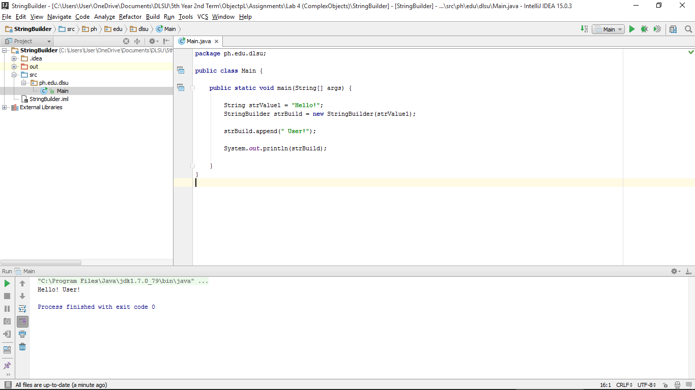

#StringBuilder

Adding of strings to another strings.

#ScreenShot

#Code

~~~
package ph.edu.dlsu;

public class Main {

    public static void main(String[] args) {

        String strValue1 = "Hello!";
        StringBuilder strBuild = new StringBuilder(strValue1);

        strBuild.append(" User!");

        System.out.println(strBuild);

    }
}
~~~
